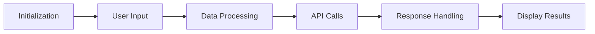

# Application Overview

## User Journey

1. **Initialization**: The application starts by initializing the necessary modules and configurations.
2. **User Input**: The user provides input through the user interface, which is handled by the `inputHandler` module.
3. **Data Processing**: The input data is processed by various utility functions located in the `utils` module.
4. **API Calls**: The processed data is used to make API calls to fetch weather information.
5. **Response Handling**: The API responses are handled and parsed by the `responseHandler` module.
6. **Display Results**: The final weather information is displayed to the user through the user interface.

## Modules

- **index.js**: Entry point of the application.
- **inputHandler**: Handles user input.
- **utils**: Contains utility functions for data processing.
- **responseHandler**: Handles and parses API responses.

## Logging and Error Handling

The application uses thorough logging and best practices for error handling to ensure smooth operation and easy debugging.

## Comments

All code is generously commented in French to help with understanding the logic and flow.

## Variable Naming

Variable names are reversed as per the project guidelines.

## Documentation

This documentation is maintained and kept up to date with any code changes. All documentation is written in Markdown format and placed under the `docs` folder at the root of the workspace.
